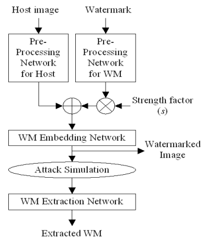

# 1. Introduction
# 1.1 워터마크란?
- 워터마크의 개념:
  - 워터마크(watermark)는 디지털 콘텐츠에 소유권, 저작권, 진위성 등을 보장하기 위해 특정 정보를 삽입하는 기술로, 눈에 보이는 형태(visible)와 보이지 않는 형태(invisible)로 구분된다. 보이지 않는 워터마크는 콘텐츠의 품질을 저해하지 않으면서도 위·변조 방지와 추적이 가능하다는 점에서 보안적 가치를 지닌다. 텍스트, 시각 자료, 영상, 음향, 게임 등 디지털 콘텐츠에는 다음과 같은 방법으로 워터마크가 삽입될 수 있다.
  1. 텍스트(Text)
    - 보이는 워터마크: 문서에 눈에 띄는 로고, 배경 텍스트(예: “CONFIDENTIAL”).
    - 보이지 않는 워터마크: 특정 단어·문장 간격, 폰트의 미세한 차이, 디지털 문서의 메타데이터에 정보 삽입.

  2. 시각 자료(Image, Graphic)
    - 보이는 워터마크: 사진 또는 그림 위에 반투명 로고, 텍스트 삽입.
    - 보이지 않는 워터마크: 픽셀 값의 LSB(Least Significant Bit) 변경, 주파수 변환(DCT, DWT)을 이용한 은닉.
    
  3. 영상(Video)
    - 보이는 워터마크: 방송사 로고처럼 화면 구석에 고정 삽입.
    - 보이지 않는 워터마크: 프레임별 주파수 영역이나 압축 계수(MPEG, H.264) 안에 삽입. 편집·압축 후에도 잔존 가능.
    
  4. 음향(Audio)
    - 보이는 개념은 불가 → 보이지 않는 워터마크만
    - 음향 신호의 주파수 대역에 사람 귀로는 구별 불가한 작은 변화를 삽입.
    
  5. 게임 및 인터랙티브 콘텐츠
    - 보이는 워터마크: 로딩 화면이나 HUD에 로고 삽입.
    - 보이지 않는 워터마크: 게임 리소스(텍스처, 사운드, 맵 데이터)에 은닉, 혹은 실행 파일 내부 코드/데이터 서명.

- 사진에 보이지 않는 워터마크를 넣는 방법도 다양하다.
  1. 공간 영역 기법 (Spatial Domain Methods)
    - LSB(Least Significant Bit) 삽입 방법
      - 각 픽셀의 가장 덜 중요한 비트(예: 8비트 중 최하위 1~2비트)를 바꿔서 워터마크 데이터를 저장.
      - 예: 픽셀 값이 10101100(172)일 때, 마지막 비트를 1로 바꿔 소유자 정보 기록 → 10101101(173).
      - 장점: 간단하고 눈에 안 띔.
      - 단점: 압축(JPEG)이나 편집 시 쉽게 손상됨.
  
  2. 주파수 영역 기법 (Frequency Domain Methods)
    - 이미지를 변환(DCT, DWT 등)한 뒤 계수에 워터마크를 삽입하는 방식
      - DCT (Discrete Cosine Transform)
      - JPEG 압축과 유사하게 이미지를 주파수 영역으로 변환 후, 저주파/중주파 영역에 워터마크 삽입.
      - 압축·노이즈에 강인함.
  
    - DWT (Discrete Wavelet Transform)
      - 이미지를 파장 단위로 분해한 후 특정 계수에 워터마크 삽입.
      - 영상·이미지 보안 연구에서 자주 사용됨.
    
  3. 특이값 분해 (SVD, Singular Value Decomposition)
    - 이미지를 행렬 분해한 뒤 **특이값(singular values)**에 워터마크를 은닉.
      - 원본 품질 손상 최소화, 변형에도 강함.
      - 주로 연구용/고급 워터마킹 기법에서 활용.
  
  4. 하이브리드 기법
    - DWT + DCT + SVD 같이 여러 변환을 조합하여 **강인성(robustness)**과 **투명성(transparency)**을 동시에 확보.
      - 예: “로고 이미지”를 원본 이미지의 주파수 변환 영역에 은닉 → 압축/회전/노이즈 추가 후에도 추출 가능.
  
  5. 특징 요약
    - 투명성: 원본 이미지 품질을 눈으로 구분할 수 없을 정도로 유지해야 함.
    - 강인성: 편집, 크기 조정, 포맷 변환 후에도 살아남아야 함.
    - 보안성: 워터마크가 쉽게 제거되거나 위조되지 않아야 함.

- 최근에는 **인공신경망(Artificial Neural Network, ANN)**을 활용한 딥러닝 기반 워터마킹 연구가 활발하게 진행되고 있습니다. 전통적인 LSB, DCT, DWT 방식이 규칙 기반이라면, 신경망은 데이터 특성과 공격(압축, 자르기, 노이즈)에 더 강인하도록 학습할 수 있다는 장점이 있습니다.
  1. 신경망 기반 워터마킹 개념
    - 아이디어: 신경망을 통해 원본 이미지에 워터마크를 삽입(embedding)하고, 손상된 이미지에서 워터마크를 추출(retrieval)하도록 엔드-투-엔드 학습.
    - 보통 두 개의 모델 또는 하나의 합성 네트워크로 구성됨:
      - Encoder (삽입기): 원본 이미지와 워터마크(로고, 비트열)를 입력받아 워터마크가 은닉된 이미지를 생성.
      - Decoder (추출기): 워터마크 삽입 후 편집·압축된 이미지에서 원래 워터마크를 복원.
    - 학습 과정에서 **“은닉 시 품질 유지” + “공격 후에도 워터마크 검출”**을 동시에 최적화.
  
  2. 대표적인 접근 방법
    - CNN 기반 워터마킹
      - 합성곱 신경망(CNN)을 이용해 이미지의 지역적 특징을 고려하며 워터마크 삽입.
      - JPEG 압축, 블러링, 크롭 등에 강인.
    
    - Autoencoder 구조
      - Encoder가 워터마크를 삽입한 이미지를 생성, Decoder가 이를 복원.
      - 이미지 변형 후에도 워터마크가 남도록 **재구성 손실(loss)**을 추가해 학습.
    
    - GAN(Generative Adversarial Network) 기반
      - 적대적 학습을 통해 워터마크 삽입 이미지가 원본과 거의 구분되지 않도록 학습.
      - 동시에 워터마크는 안정적으로 복원 가능.
    
    - 멀티태스크 학습
      - “이미지 품질 유지”와 “워터마크 복원”을 동시에 학습.
      - 일반적으로 **Perceptual Loss (사람 눈 기준 차이 최소화)**와 **Bit Error Loss (워터마크 복원 정확도)**를 함께 사용.

- 본 논문에서는 CNN기반 워터마킹에 대해 연구함

# 2. 연구 방법
## 2.1 연구도구
- Claude code를 이용하여 attack없이 인공신경망 모델을 학습하는 기본적인 파이썬 프로그램을 생성하여 분석함.
- 공격과 시각화도 claude code를 이용하여 추가하면서 연구함
- PSNR과 BER지표로 분석함

## 2.2 인공신경망의구조
- [워터마크 및 해상도 적응적인 영상 워터마킹을 위한 딥 러닝 프레임워크](https://scienceon.kisti.re.kr/commons/util/originalView.do?cn=JAKO202011263332864&dbt=JAKO&koi=KISTI1.1003%2FJNL.JAKO202011263332864)
   의 워터마크 인공신경망을 수정하여 사용하였음
- Host이미지 전처리 네트워크, 워터마크 전처리 네트워크, 워터마크 삽입네트워크, 공격 시뮬레이션, WM 추출 네트워크로 인공신경망은 구성되었고 CNN만으로 이루어졌음
- Host이미지는 128x128크기의 gray scale
- 워터마크는 8x8크기의 bit pattern



- 각 네트워크들은 ConvBlock과 ConvTransposeBlock으로 구성됨
```
class ConvBlock(nn.Module):
    def __init__(self, in_channels, out_channels, kernel_size=3, stride=1, padding=1, activation=True):
        super().__init__()
        self.conv = nn.Conv2d(in_channels, out_channels, kernel_size, stride, padding)
        self.bn = nn.BatchNorm2d(out_channels)
        self.activation = nn.ReLU() if activation else None
    def forward(self, x):
        x = self.conv(x)
        x = self.bn(x)
        if self.activation:
            x = self.activation(x)
        return x
class ConvTransposeBlock(nn.Module):
    def __init__(self, in_channels, out_channels, kernel_size=4, stride=2, padding=1, activation=True):
        super().__init__()
        self.deconv = nn.ConvTranspose2d(in_channels, out_channels, kernel_size, stride, padding)
        self.bn = nn.BatchNorm2d(out_channels)
        self.activation = nn.ReLU() if activation else None
    def forward(self, x):
        x = self.deconv(x)
        x = self.bn(x)
        if self.activation:
            x = self.activation(x)
        return x
```

- Host 전처리 네트워크:
```
ConvBlock(1, 16, kernel_size=3, stride=2, padding=1, activation=True) # 128x128 -> 64x64
ConvBlock(16, 8, kernel_size=3, stride=1, padding=1, activation=False) # 64x64 -> 64x64
```
- Watermark 전처리 네트워크:
```
ConvTransposeBlock(1, 16, kernel_size=4, stride=2, padding=1, activation=True) # 8x8 -> 16x16
ConvTransposeBlock(16, 32, kernel_size=4, stride=2, padding=1, activation=True) # 16x16 -> 32x32
ConvTransposeBlock(32, 8, kernel_size=4, stride=2, padding=1, activation=False) # 32x32 -> 64x64
```

- 워터마크 삽입 네트워크
```
ConvBlock(16, 32, kernel_size=3, stride=1, padding=1, activation=True) # 64x64 -> 64x64
ConvBlock(32, 16, kernel_size=3, stride=1, padding=1, activation=True) # 64x64 -> 64x64
ConvTransposeBlock(16, 1, kernel_size=4, stride=2, padding=1, activation=False) # 64x64 -> 128x128
```

- 워터마크 추출 네트워크
```
ConvBlock(1, 32, kernel_size=3, stride=2, padding=1, activation=True)   # 128->64
ConvBlock(32, 64, kernel_size=3, stride=2, padding=1, activation=True)  # 64->32
ConvBlock(64, 128, kernel_size=3, stride=2, padding=1, activation=True) # 32->16
ConvBlock(128, 1, kernel_size=3, stride=2, padding=1, activation=False) # 16->8
```

- Loss 함수
   - 삽입 네트워크의 출력과 host 이미지 사이의 loss는 MSE(Mean Squared Error)를 사용하였고 이것을 비가시성 에러라고 함
   - 추출 네트워크의 출력과 워터마크 사이의 loss는 MSE(Mean Squared Error)를 사용하였고 이것을 강인성 에러라고 함
   - 전체 loss는 두 에러의 가중합을 사용함
      - [전체 loss]  = 1.0 * [비가시성 에러] + 0.5 * [강인성 에러]

- 최적화 방법
   - Adam을 사용함

## 2.3 학습데이터
- 호스트 영상의 학습 데이터로 그레이(gray) 스케일 영상이10,000장으로 구성된 BOSS 데이터 셋을 128×128 해상도로 스케일링(scaling)하여 사용
   - [https://dde.binghamton.edu/download/ImageDB/BOSSbase_1.01.zip](https://dde.binghamton.edu/download/ImageDB/BOSSbase_1.01.zip)
- 평가(test) 데이터로그레이(gray) 스케일 영상이 49장으로 구성된 표준 시험데이터셋을 128×128 해상도로 스케일링하여 사용
   - [http://decsai.ugr.es/cvg/CG/base.htm](http://decsai.ugr.es/cvg/CG/base.htm)
- 빠른 학습을 위해 학습데이터 중에서 ９개、 평가 데이터 중 ３개의 이미지를 사용함
  - 학습데이터가 적어도 학습이 되는 이유는 CNN의 특성이 kernel 크기의 이미지 patch에 대하여 학습을 하는 모델이라고 볼 수 있기 때문
  - 학습 이미지는 9개뿐이지만 128x128크기의 이미지를 3x3 patch로 중첩될 수 있도록 나누면 약 14,000개의 patch가 생기므로 9개의 image는 126,000개의 patch를 학습하는 것으로 볼 수 있음

# 3. 연구내용
- CNN을 이용한 워터마킹의 원리에 대한 다음 질문에 대하여 연구함
  - 워터마킹이 어떻게 들어가는가? 8x8의 bit pattern은 어떻게 변형되어 이미지에 삽입되는가?
  - 이미지와 워터마크가 삽입된 이미지의 차이(watermark delta라고 하자)에는 어떤 패턴이 있는가? 반복 패턴 또는 0또는 1과 관련된 패턴?
  - watermark delta에서 중요한 bit가 있는가? - 한bit(한 영역의 bit)의 값을 특정 값(0?)으로 바꾸면 워터마크 검출이 어려워지나?
  - 추출 신경망의 가중치(또는 kernel)중 중요한 것이 있는가? - 커널을 0으로 하거나, 가중치를 0으로 할 때 워터마크 검출이 어려워지나?
  - watermark delta중 주어진 pixel에 영향을 주는 삽입네트워크의 가중치 또는 커널이 있는가? 가중치값을 0으로 바꿔 test
  - watermark preprocessing output에는 특별한 pattern이 있나?
  - host preprocessing output에는 특별한 pattern이 있나?
  - host image의 밝기가 watermark delta에 영향을 미치는가?
  - gaussian filtering공격과 rotation 공격을 학습한 두 모델은 watermark delta에서 차이를 보이는가?

# 4. 연구결과

# 5. 결론
